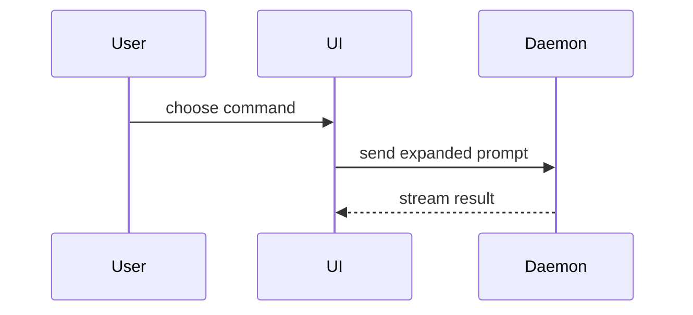

# Show Me Examples

## Explain a login flow

User: "How does login actually work here?"

Good agent behavior:

- Recognize this is a control-flow question and show a call tree of the involved functions.
- Keep the diagram to the calls that matter for the question.
- Place a one-line summary above the tree and skip the preamble.

```text
handleLogin
  validateCredentials
    hashPassword
    lookupUser
  createSession
    persistSession
  navigateToDashboard
```

## Clarify a file-layout change

User: "What would moving the API client out of `transport.ts` into its own folder change?"

Good agent behavior:

- Use a `diff` of the shallow file tree so the shape that already exists stays visible.
- Highlight only the moved and added files.

```diff
 src/
 ├── commands/
+│   └── show-me.ts       # expands the slash command
 ├── sessions/
-└── transport.ts
+└── transport/
+    ├── client.ts
+    └── stream.ts
```

## Compare two approaches to caching

User: "Should we cache the result on every save?"

Good agent behavior:

- Show the state change as a `diff` of the logic, contrasting the current write path with the proposed cache.
- Keep prose brief and end with the trade-off in one sentence.

```diff
 on(save)
-  write content
+  if content is unchanged
+    return cached result
+  write new content
+  invalidate cache
```

## Show component interaction for a dense UI

User: "Walk me through what happens when the user picks a command in the TUI."

Good agent behavior:

- Use a Mermaid sequence diagram because the interaction crosses UI and daemon boundaries.
- Include only the participants needed to answer the question.


