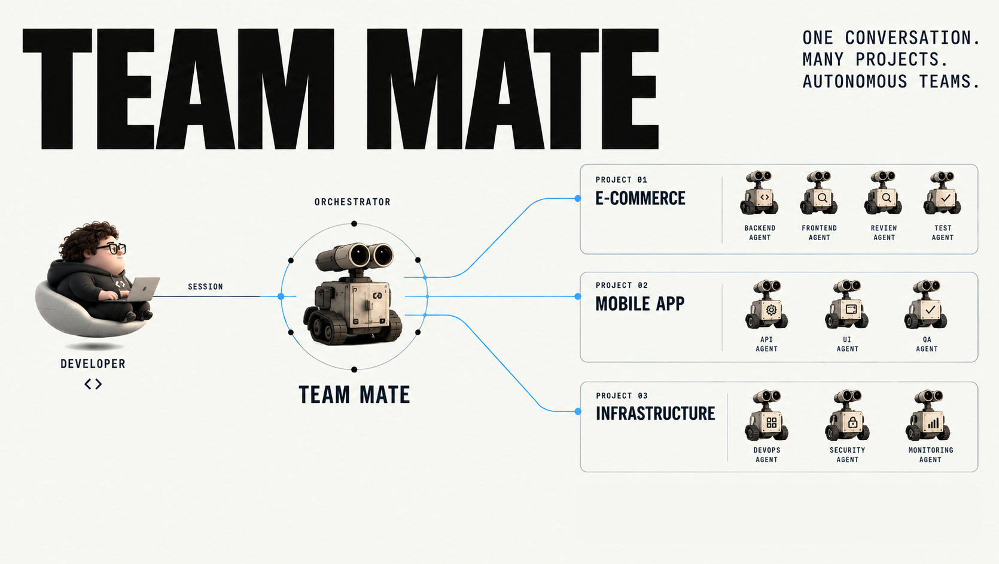

# Team Mate

<p align="center">
  
</p>

Team Mate is a **primary AI engineering agent** that coordinates other coding
agents across multiple projects.

The developer talks to Team Mate through any supported coding agent such as
OpenCode, Codex, Pi, or Claude Code. Team Mate understands its role from the
project's `AGENTS.md` and runs workers on a pluggable runtime:
[Herdr](https://herdr.dev) by default, or a headless Claude backend. The overlay
also ships as a Claude plugin for Claude Code and Cowork.

Each project keeps its own context, `AGENTS.md`, skills, scripts, and other
project-specific resources. Team Mate supplies shared capabilities on top of
that project context.

## Install

```bash
curl -fsSL https://raw.githubusercontent.com/mohammadhprp/teammate/master/install.sh \
  | sh -s -- --kind opencode
```

- Options:
  -  `--dir DIR` (default `./teammate`)
  -  `--kind KIND` Any Herdr worker kind (for example `pi`, `codex`,
`claude`, or `omp`).
  - `--force` (overwrite, keeping a `.bak`)
  - `--no-launch` (set up only).
  - `--plugin` (install the Claude plugin from `src/`, then stop; no Herdr).

After installing, run `/reload-plugins` (or restart Claude Code). You get the
Team Mate skills as `/teammate:<skill>`, four worker subagents (`developer`,
`reviewer`, `tester`, `investigator`), the `tm` CLI on the Bash `PATH`, and
best-effort session and report hooks.

In **Cowork**, enable the plugin for your claude.ai account; Claude Code
downloads it into the session, which has no Herdr.

To delegate workers to headless Claude instead of Herdr, select the `claude`
runtime:

```bash
tm --runtime claude spawn --cwd <project> --name developer-alpha
```

Or set it persistently with `runtime = "claude"` in `team-mate.toml`, or
`TM_RUNTIME=claude`. Herdr stays the default. The `--runtime` flag must come
before the subcommand.

## Overview

- [Vision](docs/VISION.md) — product vision and operating model.
- [Context](docs/CONTEXT.md) — repository guidance.
- [Research and architecture](docs/implementation/README.md) — research and implementation
- [Overlay](src/README.md) — the portable overlay.
