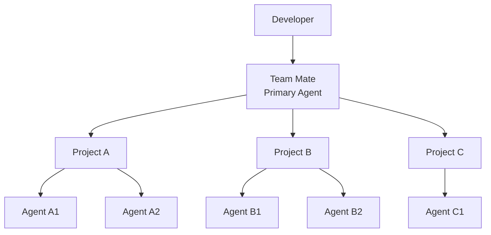

# Team Mate vision

**Team Mate is a primary AI engineering agent that manages a team of other
agents across multiple software projects.**

The developer talks to one Team Mate session inside a coding harness — OpenCode,
Codex, Claude Code, Pi, or omp. Team Mate understands its role from the
harness's instruction file (`AGENTS.md`, or `CLAUDE.md` for Claude Code), uses
shared Team Mate capabilities, and delegates work to the harness's **native
subagents**.

Team Mate is not itself an OpenCode plugin, and it is not an agent runtime. It
is a portable coordination overlay — skills, scripts, workflows, prompts, and
documentation that make the Team Mate operating model reusable across
coding-agent harnesses. It also ships as a Claude plugin, so the same model runs
in Claude Code and Cowork.

## Core idea



## The problem

Working with multiple AI coding agents normally makes the developer responsible
for coordination:

1. Decide which agent should do each task.
2. Create and configure sessions.
3. Give agents enough project context.
4. Monitor their progress.
5. Collect results and logs.
6. Review their work.
7. Send feedback and request fixes.
8. Coordinate work across projects.
9. Decide when the overall task is complete.

Team Mate should take responsibility for this coordination while keeping the
developer informed and in control.

## The Team Mate role

Team Mate is the **primary agent**, not a fixed worker or a predefined team.

It can create as many agents as necessary and choose the type of agent based on
the task. An agent may be used for implementation, review, debugging, testing,
investigation, planning, documentation, or any other useful role.

Team Mate decides:

- when to delegate work;
- how many agents are useful;
- which project each agent should work on;
- what context each agent needs;
- when an agent should be monitored or queried;
- when work should be reviewed;
- when another agent should fix a problem;
- when the developer needs to be informed or asked to decide.

## Multi-project operation

One Team Mate session can coordinate work across multiple projects.

For example:

```text
Developer
    │
    ▼
Team Mate
    │
    ├── Project A
    │     ├── Agent A1
    │     └── Agent A2
    │
    └── Project B
          ├── Agent B1
          └── Agent B2
```

A project has its own context and instructions. Agents created for that project
must use that project's `AGENTS.md`, `CONTEXT.md`, skills, scripts, and other
relevant resources.

Team Mate's shared skills and scripts are available in addition to the
project-specific resources.

The goal is to prevent unrelated project context from leaking between projects
while still allowing Team Mate to coordinate the overall work.

## How a session starts

The developer can open a normal coding-agent session and say what they want.
The repository's instruction file (`AGENTS.md`, or `CLAUDE.md` for Claude Code)
establishes that the agent is operating as Team Mate.

Conceptually:

```text
Developer opens OpenCode / Codex / Claude Code / Pi / omp
                │
                ▼
   Harness loads its instruction file (AGENTS.md / CLAUDE.md)
                │
                ▼
        Agent assumes Team Mate role
                │
                ▼
       Developer gives a task or goal
                │
                ▼
        Team Mate coordinates work
```

There is no requirement for the developer to manually create every worker
subagent.

## The harness-native subagent model

Team Mate does not run its own agent runtime. The primary runs **inside one
coding harness** — `opencode`, `codex`, `claude`, `pi`, or `omp` — and workers
are that harness's **native subagents**, spawned by the primary through the
harness's own subagent tool. Team Mate builds on the runtime the harness already
provides rather than reimplementing one.

`tm` is a **ledger-only CLI**. It records tasks, briefs, reports, findings, and
decisions, and renders the adapter-specific pieces (skills and agent
definitions) for the resolved harness — it does not spawn, send to, or stop
processes. The primary's harness supplies the live capability: spawning a
subagent, waiting for it, sending it more input, and closing it.

Because the harness is the runtime, Team Mate adapts to each harness's shape:
its subagent tool, its agent-definition and skills directories, its instruction
and config files, and whether it supports background subagents. The per-harness
adapter matrix is in
[Harness adapters](implementation/16-harness-adapters.md).

The Team Mate repository therefore focuses on the **coordination layer**:

- reusable skills;
- reusable scripts (the `tm` ledger CLI);
- agent instructions;
- workflows;
- project-context conventions;
- review protocols;
- monitoring and reporting patterns;
- experiments and research.

The harness is an implementation dependency of the coordination model, not the
product itself. Team Mate stays portable across harnesses by describing each
one's adapter rather than by shipping a runtime of its own.

## Shared and project-specific capabilities

There are two layers of agent knowledge.

### Team Mate layer

Shared capabilities that can be reused across projects, such as:

- agent creation and coordination;
- monitoring and waiting;
- progress reporting;
- review workflows;
- delegation patterns;
- debugging workflows;
- testing workflows;
- investigation patterns;
- common scripts and utilities.

### Project layer

Capabilities belonging to one project, such as:

- project architecture;
- coding conventions;
- project-specific skills;
- scripts and commands;
- deployment knowledge;
- domain rules;
- project context;
- project-specific acceptance criteria.

The agent should combine both layers when working.

## Delegation

Team Mate should provide each agent with a clear, self-contained assignment.
The assignment should include the relevant goal, constraints, expected outcome,
acceptance criteria, and discovered context.

The created agent should also inspect the target project's own `AGENTS.md`,
`CONTEXT.md`, skills, scripts, and relevant documentation before working.

Team Mate should not assume that every task needs the same number or type of
agents. It should use the smallest useful team, while being free to create more
agents when parallelism or specialization provides value.

## Monitoring

After delegation, Team Mate remains responsible for the work it delegated.

It should be able to determine:

- whether agents are working;
- what progress they have made;
- whether they are blocked;
- whether they finished;
- what they changed;
- whether their result requires review;
- whether another intervention is needed.

Monitoring should be practical rather than noisy. Team Mate should collect
useful state, output, and logs and present them to the developer when they are
important for understanding progress or making a decision.

## Review

Agent completion is not proof of correctness.

Team Mate should use independent review when the task warrants it. A reviewer
can inspect the implementation, tests, diffs, requirements, and project
conventions and report findings back to Team Mate.

A review may result in:

- approval of the work;
- findings that require rework;
- a request for additional testing;
- a request for another specialized agent;
- escalation to the developer.

## Iteration

Team Mate can coordinate repeated work and review cycles:

```text
Delegate
   ↓
Work
   ↓
Review
   ↓
Issues?
 ┌─┴───────────┐
Yes            No
 │              │
Fix            Report
 │              │
 └──→ Review    │
                ▼
             Developer
```

The number of iterations should be bounded by practical policies and should
escalate when agents repeatedly fail to converge.

## Developer visibility

Automation must not make the process opaque.

The developer should receive a useful report when work reaches an important
state. Depending on the situation, the report can include:

- requested work;
- projects involved;
- agents created;
- current status;
- important progress;
- relevant logs or output;
- files or changes produced;
- review findings;
- fixes performed;
- remaining concerns;
- blockers;
- recommended next action.

The developer should not receive every low-level event unless requested or
useful for debugging the workflow.

## Developer control

The developer remains the final decision-maker for consequential actions.

Team Mate can autonomously coordinate normal development work, but it should
escalate when a decision requires developer intent, when the work is ambiguous,
when agents are blocked, or when an action has meaningful risk.

The developer can then:

- approve the result;
- request changes;
- ask for more investigation;
- ask for another review;
- stop the workflow;
- change the goal;
- continue working on another project.

## Transparency and traceability

A useful Team Mate system should preserve enough history to reconstruct what
happened:

```text
Request
  ↓
Plan / Delegation
  ↓
Agent Work
  ↓
Progress / Logs
  ↓
Review
  ↓
Rework
  ↓
Final Report
  ↓
Developer Decision
```

The implementation of this history is an R&D topic. The vision only requires
that the important workflow remains observable and explainable.

## Long-term vision

Team Mate should feel like a **virtual engineering manager and teammate** that
can operate across the developer's projects.

The developer should be able to say:

> "Work on project A and implement feature X."

and later:

> "Now investigate the bug in project B and have two agents look at it."

Team Mate should understand the active project context, create the appropriate
agents, coordinate them through the harness's native subagent tool, use the
shared Team Mate capabilities, and report the outcome.

The developer should think about **what needs to happen**, not about manually
operating a collection of agent sessions.

## Guiding principle

> **One primary agent. Many specialized agents. Multiple projects. Shared
> capabilities. The developer stays in control.**
