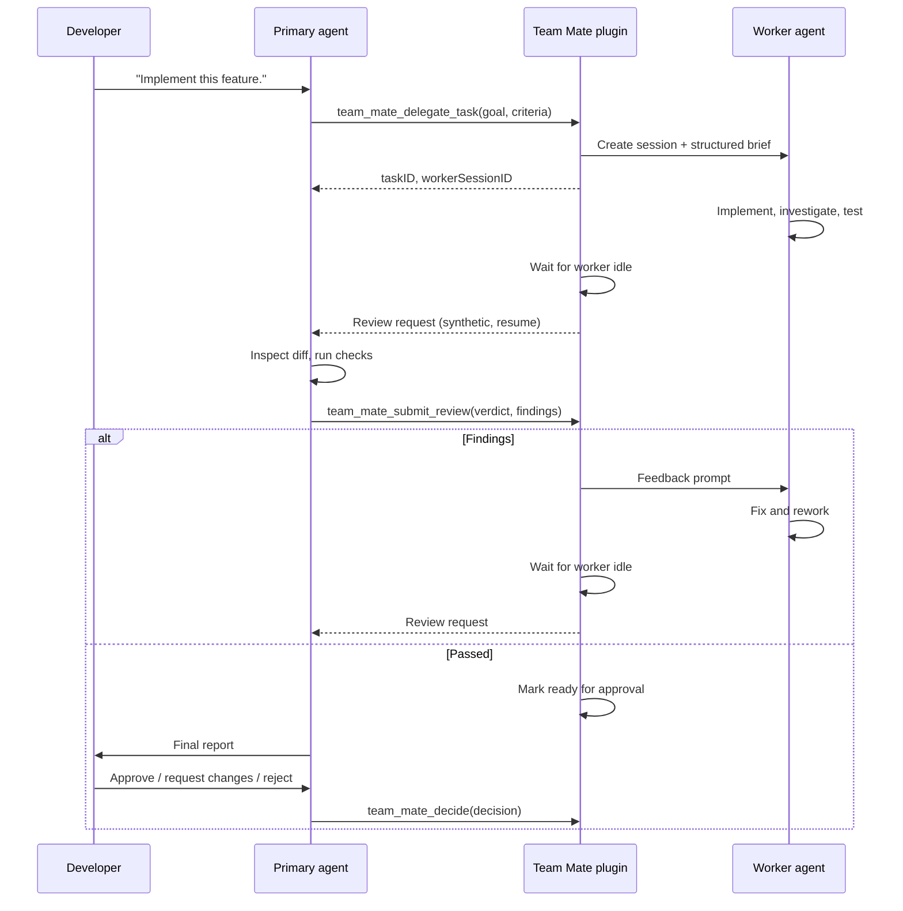

# Architecture

Team Mate separates execution from supervision. The developer interacts with
one primary agent. A deterministic orchestration engine in the plugin manages
worker sessions, review cycles, and persisted state.

## Components

| Component | Type | Responsibility |
| --- | --- | --- |
| Developer | Person | Defines intent. Approves, rejects, or redirects work. |
| Primary agent | OpenCode agent (`mode: primary`) | Talks to the developer. Delegates, reviews, decides. |
| Worker agent | OpenCode agent (`mode: subagent`) | Executes one delegated task and reports. |
| Team Mate plugin | Effect plugin | Creates sessions, monitors progress, routes feedback, persists state. |
| Worker session | OpenCode session | The durable record of a worker's work. |
| Plugin storage | `ctx.storage` | Durable task, review, and audit state. |

The primary agent and the plugin are the same "primary" side of the workflow.
The primary agent supplies judgment; the plugin supplies coordination.

## Roles

```text
Developer
  └── Defines intent, approves outcome

Primary agent
  └── Understands intent, delegates, reviews, reports

Team Mate plugin
  └── Creates sessions, monitors, persists, routes

Worker agent
  └── Executes the assigned task
```

## Control flow



## Data flow

The plugin keeps a small in-memory model synchronized with durable storage.

- **In memory:** a `Ref` holding task records, a command `Queue` for
  orchestration, and a `Queue` of normalized OpenCode events.
- **In storage:** one record per task plus an append-only timeline of audit
  entries. Storage is the source of truth after a reload.
- **In OpenCode:** the worker session history, the primary session history, and
  the repository state.

Only the plugin writes task state. Tool executors and the event consumer send
commands to a single orchestrator fiber, which mutates state. This avoids
concurrent writes to the same task.

## Lifecycle

```text
Plugin load
  ├── Register tools
  ├── Register commands (optional)
  ├── Start orchestrator fiber
  ├── Start event consumer fiber
  └── Recover interrupted tasks from storage

Plugin unload or reload
  └── Scope closes: fibers interrupt, registrations dispose
```

Because the orchestrator runs in the plugin scope, unloading or reloading the
plugin interrupts in-flight monitoring. Recovery on load reads task state and
resumes tasks that were `working` or `reviewing` when the plugin stopped.

## Design decisions

### The plugin coordinates; the primary agent judges

The plugin never decides whether work is correct. It gathers evidence (diff,
worker report, test results) and asks the primary agent to review. This keeps
quality judgments in an LLM that can read code, while keeping scheduling in
deterministic code.

### Review runs in the primary session

The vision states the primary agent performs the review. The plugin delivers a
review request to the same session the developer is using. The developer can
watch the review happen, which preserves transparency. The plugin uses queued
delivery so a review never interrupts an active developer turn.

### Workers are ordinary OpenCode sessions

A worker is not a custom runtime. It is a normal session with the worker agent.
The developer can open it in the OpenCode UI, read its history, and interrupt
it. This reuses OpenCode's durability, tooling, and permissions instead of
reimplementing them.

### Completion is idle, not a claim

The plugin waits for the worker session to become idle with `session.wait`. It
then reads the session `outcome`. A worker that says "done" only starts the
review step; it cannot approve its own work.

### State is durable and append-only for history

Task records change in place. The audit timeline does not. The final report is
assembled from the timeline, so the developer can trace request to approval.

## Scope

### In scope for v1

- Delegate a task to one worker session.
- Monitor the worker until idle.
- Review with the primary agent.
- Route findings back to the worker.
- Iterate until pass or a configured limit.
- Present a report and record the developer decision.
- Persist task state and an audit timeline.

### Out of scope for v1

- Parallel workers on one task.
- Automatic commits, merges, or pushes.
- Worktree creation inside the plugin. See
  [Security and isolation](08-security-and-isolation.md).
- Cross-location or multi-project coordination.
- Custom review UI. Reviews use the primary session and tools.

## Failure handling

| Failure | Response |
| --- | --- |
| Worker errors or is interrupted | Mark the task `failed`. Notify the primary agent with the error. |
| Worker idle without a usable report | Treat as `awaiting_review` with an empty report. The primary reviews what exists. |
| Review limit reached | Mark the task `ready_for_approval` with remaining findings. Escalate to the developer. |
| Plugin reload mid-task | On load, mark in-flight tasks `paused` and ask the primary agent how to proceed. |
| Primary session missing | Store the task as `orphaned`. Surface it through `team_mate_list_tasks`. |
