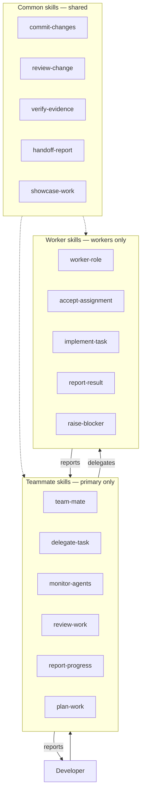

# Skills plan

**Status:** delivered. All 30 planned skills are built under `src/skills/`; this
document is the plan they were built from.

Team Mate is, above all, a library of skills. The role definition, the `tm` CLI,
and the templates only matter once the primary agent and its workers know *how*
to plan, delegate, build, verify, and report. This plan defines that library
before any `SKILL.md` is written.

The skills fall into three categories by **audience**:

| Category | Who runs it | What it covers |
| --- | --- | --- |
| **Common** | The primary **and** workers | Engineering work both sides must share: committing, reviewing, proving results, showing work to the developer. |
| **Teammate** | The primary only | Coordination: turning a goal into tasks, delegating, monitoring, reviewing, reporting to the developer. |
| **Worker** | Worker agents only | Execution inside a project tab: accepting an assignment, building, verifying, reporting back to the primary. |

Rule of thumb: if both the primary and a worker perform the activity, it is
**common**; if only whoever coordinates does, it is **teammate**; if only
whoever executes does, it is **worker**.



## Why plan first

- **Skills are the product.** Everything else is plumbing for them.
- **The repository is research-driven.** `docs/NEXT.md` and
  `09-rd-roadmap.md` reject speculative abstraction. A catalog agreed up front
  prevents twenty ad-hoc skills with overlapping triggers.
- **The gaps are structural, not cosmetic.** Today the worker side has *no*
  skills and the shared side is empty, yet workers still need to build, verify,
  and report. That is the main risk this plan addresses.
- **One vocabulary.** "Review", "verify", "report", and "commit" mean different
  things in different places today. The plan fixes the ownership of each.

## Scope

In scope:

- the category model (common / teammate / worker);
- an inventory of what exists and what is missing;
- a catalog and a per-skill specification for every planned skill;
- naming, format, and distribution conventions;
- sequencing and verification gates.

Out of scope:

- writing the `SKILL.md` files themselves (a separate change, after review);
- project-local skills, which each target project owns;
- runtime, plugin, or `tm` CLI changes beyond what a skill needs.

## Current state

All 30 planned skills are now built under `src/skills/`; with `visual-report`
(added later) the library is 31: 16 teammate, 7 common, and 8 worker. It started
from six primary (teammate) skills:

| Skill | Category | Notes |
| --- | --- | --- |
| `team-mate` | Teammate | Owns the coordination loop. |
| `delegate-task` | Teammate | Spawn a worker + brief. |
| `monitor-agents` | Teammate | Wait, poll, detect blockers, cancel. |
| `review-work` | Teammate | Coordinate review, verdict, rework. |
| `report-progress` | Teammate | Developer report + notification. |
| `multi-project-context` | Teammate | Project resolution and isolation. |

The gaps this plan set out to close are addressed:

1. **Common is built.** Seven common skills carry the shared commitment to how
   work is proved, reported, reviewed, and committed.
2. **Worker is built.** Eight worker skills cover accepting an assignment,
   building, self-verifying, raising a blocker, reporting back, and reviewing.
3. **`team-mate` delegates.** Planning and the ledger are extracted into
   `plan-work` and `task-ledger`; `team-mate` points at them.
4. **Review is layered.** `review-change` owns the method, `review-work`
   coordinates, and `independent-review` / `review-task` / `run-rework` own
   independent review and rework.
5. **Distribution to workers is resolved and implemented.** The overlay installs
   skills into `<primary>/.agents/skills/`, but workers run in target projects;
   `tm spawn` / `tm skills sync` copy the common and worker skills into
   `<project>/.agents/skills/` (option B/C, below).

## Skill contract

Every skill, regardless of category, must satisfy the contract from
[Skill system](02-skill-system.md): it states when to use it, required context,
available tools/scripts, the procedure, the expected output, and failure and
escalation behavior.

Format, matching the existing skills:

```text
src/skills/<name>/
  SKILL.md          # YAML frontmatter: name + description, then the contract
  examples.md       # optional: a worked walkthrough
  references/       # optional: schemas and detail too long for SKILL.md
```

```markdown
---
name: <kebab-case-name>
description: "<what it does, plus concrete triggers: 'Use when ...'>"
---
```

Conventions:

- **Names are kebab-case and verb-led** (`review-change`, `raise-blocker`),
  matching `delegate-task`, `report-progress`, `review-work`.
- **The description carries the trigger.** It is what the runtime matches on;
  it must say what the skill does *and* when to load it.
- **One skill owns one trigger.** Two skills must not both claim "review a
  change"; the common method and the teammate/worker wrappers are layered, not
  duplicated (see [Layering](#layering-avoiding-duplication)).
- **A skill is instructions, not a wrapper.** If a deterministic script already
  does the job, the skill points at the script instead of restating it.

## Naming and metadata

| Field | Rule |
| --- | --- |
| `name` | kebab-case, unique, verb-led, matches the directory name. |
| `description` | One sentence: capability + explicit "Use when …" triggers. |
| Audience | Encoded by category, not a frontmatter field, until the runtime needs it. |
| Status | Tracked in this plan (`existing`, `planned`), not in the skill file. |

If the runtime later supports role scoping, a `roles: [primary, worker]` field
can be added without renaming anything.

## Distribution: how a skill reaches its audience

The installer maps `src/skills/` to `<primary>/.agents/skills/`. That reaches
the primary but not workers, which run with `--cwd` set to a target project.
This was the one question that fully blocked the worker category, resolved by
the B/C choice below.

Options:

| Option | How it works | Tradeoff |
| --- | --- | --- |
| **A. Shared directory referenced by config** | Workers resolve skills from one shared Team Mate skills path. | Single source of truth; needs the runtime to support an external skill dir. |
| **B. Install into each target project** | Copy common + worker skills into `<project>/.agents/skills/`. | Works today; duplicates files and drifts on update. |
| **C. Install once, per project, on first spawn** | `tm spawn` syncs the shared skills into the project. | Keeps projects current; `tm` becomes a writer to target repos. |
| **D. Encode worker skills in the brief** | The brief carries the worker procedure verbatim. | No distribution problem; bloats every brief and cannot evolve. |

Chosen: **B/C — a sync into the project on spawn.** `tm spawn` copies the
configured `worker_skills` into `<project>/.agents/skills/` before starting the
agent, tracked by a manifest so it is idempotent and never overwrites a
project-owned skill; `tm skills sync` runs the same sync on demand. This matches
the `.agents/skills` discovery path a worker's agent already uses. Option A (a
purely shared path) remains a possible optimization once the supporting kinds'
global skill directories are known. Do not start with D — it makes the skill
library invisible to workers.

The primary already loads Team Mate skills from its own `.agents/skills/`;
project-local skills keep composing on top, per
[Multi-project context](04-multi-project-context.md).

## Layering: avoiding duplication

Three concepts recur. They are one method with two wrappers, not three skills
that repeat each other:

```text
verify-evidence (common method)
      │
review-change (common method: review a diff against criteria)
      │
      ├── review-work  (teammate: decide when, spawn a reviewer, drive rework)
      └── review-task  (worker: perform the review, return findings only)

handoff-report (common: the report contract)
      │
      ├── report-progress (teammate: developer report + decision request)
      └── report-result   (worker: end-of-task report to the primary)
```

New skills must slot into this shape rather than introduce a parallel one.

## Catalog

### Common skills

| Priority | Skill | Audience | Purpose | Status |
| --- | --- | --- | --- | --- |
| P0 | `commit-changes` | both | Make atomic, conventional commits that match the project. | existing |
| P0 | `load-project-context` | both | Read `AGENTS.md` / `CONTEXT.md` / local skills before acting. | existing |
| P0 | `verify-evidence` | both | Prove a claim with a command and captured output; no evidence, no claim. | existing |
| P0 | `handoff-report` | both | The shared structured report contract between roles. | existing |
| P1 | `review-change` | both | Review a diff against criteria; findings, severity, verdict. | existing |
| P1 | `showcase-work` | both | Present finished work to the developer or the primary clearly. | existing |
| P2 | `debug-issue` | both | Reproduce → hypothesise → minimal fix → verify. | existing |

### Teammate skills

| Priority | Skill | Purpose | Status |
| --- | --- | --- | --- |
| — | `team-mate` | Own the coordination loop. | existing |
| — | `onboard-developer` | Introduce the developer to Team Mate: who it is and what it can do. | existing |
| — | `delegate-task` | Spawn a worker and hand it a scoped brief. | existing |
| — | `monitor-agents` | Track worker lifecycle and collect evidence. | existing |
| — | `review-work` | Decide when to review, verify output, drive rework. | existing |
| — | `report-progress` | Assemble the developer report and ask for a decision. | existing |
| — | `multi-project-context` | Resolve projects and keep context isolated. | existing |
| P0 | `bootstrap-project` | Install the skills the work needs and write the project's `AGENTS.md`. | existing |
| P0 | `plan-work` | Turn a goal into acceptance criteria and the smallest team. | existing |
| P0 | `task-ledger` | Persist, list, and recover tasks across restarts. | existing |
| P1 | `independent-review` | Create and brief a separate reviewer worker. | existing |
| P1 | `run-rework` | Feed findings back, bound iterations, detect non-convergence. | existing |
| P1 | `escalate-decision` | When and how to interrupt the developer; approval gates. | existing |
| P2 | `parallel-coordination` | Run independent workers, merge results, avoid write conflicts. | existing |
| P2 | `recover-run` | Restart, orphaned/blocked/`unknown` agents, cancellation. | existing |
| P1 | `visual-report` | Render the developer-facing report as self-contained HTML. | existing |

### Worker skills

| Priority | Skill | Purpose | Status |
| --- | --- | --- | --- |
| P0 | `worker-role` | How to act as a worker: scope, autonomy, when to ask. | existing |
| P0 | `accept-assignment` | Parse the brief, restate goal and criteria, confirm or ask. | existing |
| P0 | `implement-task` | Build the change inside the project's conventions. | existing |
| P0 | `report-result` | Close the task with a structured report to the primary. | existing |
| P1 | `verify-change` | Self-verify with tests and evidence before claiming done. | existing |
| P1 | `raise-blocker` | Ask a precise question instead of guessing. | existing |
| P1 | `review-task` | Act as an independent reviewer; return findings only. | existing |
| P2 | `investigate-issue` | Read-only investigation: evidence and conclusion, no scope creep. | existing |

## Skill specifications

Each spec follows the same shape: purpose, use when, not when, inputs,
procedure, output, failure/escalation, dependencies. P0 specs are the first
slice and are written out fully; P1/P2 are scoped but expected to be refined
against evidence from the loop.

### Common skills

#### `commit-changes` — P0

- **Purpose:** Turn a completed, approved change into atomic commits that match
  the project's conventions.
- **Use when:** The developer has approved work and committing is in scope.
- **Not when:** Work is unverified, unapproved, or the project commits itself.
- **Inputs:** Staged intent, the project's commit convention, the approved task.
- **Procedure:** Inspect the diff; group changes into one logical unit per
  commit; write a conventional message with a scope and body; never mix
  formatting-only changes with behaviour; never commit generated noise.
- **Output:** One or more commits, each with a message and a summary.
- **Failure/escalation:** Ambiguous grouping, secrets in the diff, or a missing
  convention → stop and ask. `commit`/`merge`/`push` remain gated by developer
  approval (see `escalate-decision`).
- **Depends on:** `load-project-context`, `verify-evidence`.

#### `load-project-context` — P0

- **Purpose:** Ensure any agent reads the target project's own instructions
  before touching it.
- **Use when:** Starting work in a project, or when instructions might conflict.
- **Not when:** Continuing an already-loaded task in the same project and tab.
- **Inputs:** Project root, the coding agent's context precedence.
- **Procedure:** Read `AGENTS.md` and `CONTEXT.md`; discover local skills and
  the project's commands; apply precedence (platform → Team Mate → project →
  task); do not read another project's context.
- **Output:** The constraints, commands, and conventions that govern the task.
- **Failure/escalation:** Missing context files or a conflict across layers →
  surface it rather than guessing.
- **Depends on:** none.

#### `verify-evidence` — P0

- **Purpose:** Make "done" mean proven, not claimed.
- **Use when:** Any agent is about to assert that something works.
- **Not when:** Never skipped — this is the shared evidence standard.
- **Inputs:** The claim, the project's test/check commands.
- **Procedure:** Name the claim; run the project's own command; capture the
  actual output; state what was *not* checked; distinguish a pass with zero
  checks (a process failure) from a real pass.
- **Output:** Claim + command + result, suitable for a report.
- **Failure/escalation:** Cannot reproduce or cannot run → report
  `inconclusive`, never success.
- **Depends on:** `load-project-context`.

#### `handoff-report` — P0

- **Purpose:** One structured report contract shared by workers and the primary.
- **Use when:** Finishing a task, or reporting a meaningful state.
- **Not when:** Nothing important changed.
- **Inputs:** The goal and criteria, the diff, the evidence, open concerns.
- **Procedure:** Fill the shared shape — requested, implemented, changed,
  verified, issues, remaining concerns, assessment; back every claim with
  evidence; include the unresolved items honestly.
- **Output:** A report that a reader can act on without opening the session.
- **Failure/escalation:** Missing evidence → say so and mark `inconclusive`.
- **Depends on:** `verify-evidence`.

#### `review-change` — P1

- **Purpose:** The shared method for reviewing a change against its criteria.
- **Use when:** A diff must be checked, by a reviewer worker or the primary.
- **Not when:** The task is still running.
- **Inputs:** Goal, acceptance criteria, the diff, the project's checks.
- **Procedure:** Collect fresh evidence (diff + full files + tests); check every
  criterion explicitly; record one finding per observation with severity and
  category; otherwise ignore noise; produce a `pass` / `fail` / `inconclusive`
  verdict with the checks named. Severity and categorisation follow
  `references/findings.md`.
- **Output:** Findings plus a verdict.
- **Failure/escalation:** A `pass` with zero checks is invalid; `inconclusive`
  escalates.
- **Depends on:** `verify-evidence`.

#### `showcase-work` — P1

- **Purpose:** Present finished work in a form the developer can judge quickly.
- **Use when:** Work reaches a state worth showing, or the developer asks.
- **Not when:** Routine progress with nothing to see.
- **Inputs:** The report, the diff stat, any runnable artifact or screenshot.
- **Procedure:** Lead with the outcome; show the smallest convincing artifact
  (command output, screenshot, diff stat, before/after); state one recommended
  next action; keep it short.
- **Output:** A developer-facing summary.
- **Failure/escalation:** Cannot demonstrate the result → say so; do not
  substitute a description for evidence.
- **Depends on:** `handoff-report`, `verify-evidence`.

#### `debug-issue` — P2

- **Purpose:** A repeatable debugging loop that separates cause from guess.
- **Use when:** Something fails and the cause is not obvious.
- **Not when:** A trivial, already-understood fix.
- **Inputs:** The failure, reproduction steps, the project's tooling.
- **Procedure:** Reproduce; capture the failure; form one hypothesis at a time;
  make the minimal change; verify the fix and the absence of regression.
- **Output:** Root cause, the fix, and the verification.
- **Failure/escalation:** Cannot reproduce → report it and ask for a repro.
- **Depends on:** `load-project-context`, `verify-evidence`.

### Teammate skills

Existing skills (`team-mate`, `delegate-task`, `monitor-agents`,
`review-work`, `report-progress`, `multi-project-context`) stay as they are,
with two planned refinements: extract planning and the ledger out of
`team-mate`, and point `review-work` / `report-progress` at the common methods.

#### `plan-work` — P0

- **Purpose:** Convert an ambiguous goal into explicit, testable work.
- **Use when:** A request should be delegated or spans more than a trivial edit.
- **Not when:** A one-line, low-risk, local change.
- **Inputs:** The goal, the resolved project(s), `team-mate.toml` limits.
- **Procedure:** Restate the goal; derive acceptance criteria that a reviewer
  could check; decide serial vs parallel; choose the smallest useful team; pick
  each worker's role; identify what needs developer clarification *before*
  delegating.
- **Output:** A task plan with criteria, team size, and roles.
- **Failure/escalation:** Ambiguous or consequential goal → ask before spending
  agents.
- **Depends on:** `multi-project-context`.

#### `task-ledger` — P0

- **Purpose:** Make coordination survive a restart or compaction.
- **Use when:** Creating, updating, or recovering a task; after a restart.
- **Not when:** A task that will never be reported on.
- **Inputs:** `state_dir` from `team-mate.toml`, task metadata, worker names.
- **Procedure:** Create a task before spawning; link every worker to it; update
  status at each transition; recover with `tm task list` /
  `tm task find --worker`; keep statuses to the defined set.
- **Output:** A durable task record with goal, criteria, iteration, and report.
- **Failure/escalation:** A worker recorded but absent from `tm status` is
  orphaned; mark `failed` and escalate (see `recover-run`).
- **Depends on:** `tm` CLI / `task_store.py`.

#### `bootstrap-project` — P0

- **Purpose:** Give a project its context and skills before work is delegated.
- **Use when:** First contact with a project, or the project has no `AGENTS.md`,
  or the work needs a capability the project lacks.
- **Not when:** The project already has solid context and the needed skills.
- **Inputs:** The resolved project root, the work, and any existing
  `AGENTS.md` / `CONTEXT.md`.
- **Procedure:** Read what exists; detect the stack; use `find-skills` to find
  and install the skills the work needs, project-scoped; write or update
  `AGENTS.md` from `templates/project-AGENTS.md`; create `CONTEXT.md` if missing;
  report.
- **Output:** A prepared project — context in place, needed skills installed.
- **Failure/escalation:** No suitable skill → continue with the common and
  worker skills; conflicting project context or an overwrite → propose, do not
  clobber.
- **Depends on:** `multi-project-context`, `load-project-context`, `find-skills`.

#### `onboard-developer` — P1

- **Purpose:** Give a developer new to Team Mate a correct mental model and a
  next action.
- **Use when:** A first session, or they ask who you are, what you can do, or
  how to use you.
- **Not when:** They already gave you a task.
- **Inputs:** `team-mate.toml`, and any known projects or ledger tasks.
- **Procedure:** One line on what Team Mate is; what it does (plan, delegate,
  monitor, review, report); what it takes on; how to hand it work; what the
  developer still controls; one concrete next step.
- **Output:** A short orientation and a next action.
- **Failure/escalation:** Drop the tour if they want a task; do not overclaim
  beyond what is configured.
- **Depends on:** `team-mate`.

#### `independent-review` — P1

- **Purpose:** Prevent a worker from being the only judge of its own work.
- **Use when:** the change is important or risky, or a criterion is hard to
  self-check — the primary-review gate itself is `review-work`'s, not this
  skill's.
- **Not when:** Trivial or already reviewed work.
- **Inputs:** Objective, acceptance criteria, evidence, the common review method.
- **Procedure:** Spawn a reviewer worker with `review-task`; give it the
  criteria and evidence, not the implementer's conclusion; ask for findings
  only; collect via `monitor-agents`.
- **Output:** Independent findings and a verdict.
- **Failure/escalation:** Reviewer inconclusive or disputed → escalate.
- **Depends on:** `delegate-task`, `review-change`, `review-task`.

#### `run-rework` — P1

- **Purpose:** Turn findings into a bounded fix loop that converges or stops.
- **Use when:** Review fails with an open `blocker`/`major`.
- **Not when:** Only `minor`/`nit` findings remain — document and proceed.
- **Inputs:** Open findings, the same worker, `max_iterations`.
- **Procedure:** Send only the open findings, grouped by severity, with
  file/line, expected behaviour, a ban on scope expansion, and the same report
  requirement; then monitor → review again; stop at the limit.
- **Output:** Either a pass or a bounded escalation.
- **Failure/escalation:** Non-convergence at the limit → escalate with the full
  report and one question.
- **Depends on:** `delegate-task`, `monitor-agents`, `review-work`.

#### `escalate-decision` — P1

- **Purpose:** Interrupt the developer only when it matters, and clearly.
- **Use when:** A worker is blocked/failed; criteria are ambiguous; an action is
  risky; a consequential action (merge, push, publish, deploy, delete, secrets)
  needs approval; the iteration limit is reached.
- **Not when:** Routine progress.
- **Inputs:** The state, the evidence, the decision required.
- **Procedure:** Lead with the situation and the exact question; include the
  smallest evidence that makes the decision possible; offer the options; never
  answer a blocked worker's dialog on its behalf.
- **Output:** A decision request the developer can answer in one step.
- **Failure/escalation:** Buried question → rewrite it. Silence is not consent.
- **Depends on:** `report-progress`.

#### `parallel-coordination` — P2

- **Purpose:** Run independent workers at once without corrupting shared state.
- **Use when:** Tasks are genuinely independent and `max_concurrent` allows.
- **Not when:** Work streams share files or ordering.
- **Inputs:** The plan, worker names, the project roots.
- **Procedure:** Spawn without `--wait`; poll with `tm status`; define a merge
  order; forbid parallel writes to the same files unless a conflict strategy
  exists; merge results in the primary, not in a worker.
- **Output:** Combined results with a merge/conflict note.
- **Failure/escalation:** Conflict or unexpected overlap → stop one stream and
  escalate.
- **Depends on:** `plan-work`, `monitor-agents`, `task-ledger`.

#### `recover-run` — P2

- **Purpose:** Recover from restarts and unhealthy agents.
- **Use when:** The primary restarted; a worker is orphaned, stuck, blocked, or
  `unknown`.
- **Not when:** A healthy, progressing run.
- **Inputs:** The ledger, `tm status`, timeouts.
- **Procedure:** Reconcile the ledger against live agents; classify
  orphan/stuck/blocked/`unknown`; cancel what is unsafe; resume or re-delegate
  what is lost; never resend a prompt that may already be delivered.
- **Output:** A recovered, consistent run state.
- **Failure/escalation:** Ambiguous recovery → escalate rather than duplicate
  work.
- **Depends on:** `task-ledger`, `monitor-agents`.

#### `visual-report` — P1

- **Purpose:** Turn the developer-facing report into one self-contained HTML file
  whose visuals are the evidence.
- **Use when:** Reporting a result to the developer and a text report would hide
  the point — a UI to see, a before/after, or a concrete example.
- **Not when:** Routine progress; unverified work.
- **Inputs:** The `handoff-report` content, the diff and checks, rendered UI
  screenshots, `scripts/render_report.py`, `references/report-schema.md`.
- **Procedure:** Assemble from facts; pick the visual the work demands; capture
  the artifacts and keep the command; write the manifest; render and open the
  file; ask for the decision.
- **Output:** An offline HTML report path plus the one-line summary and decision.
- **Failure/escalation:** No screenshot → show the code/example/checks view and
  say so; never fabricate an image; nothing verifiable → do not render.
- **Depends on:** `handoff-report`, `verify-evidence`; delivered by
  `report-progress`.

### Worker skills

#### `worker-role` — P0

- **Purpose:** Establish how to behave as a worker at all.
- **Use when:** Any worker starts.
- **Not when:** Never skipped.
- **Inputs:** The brief, the target project's context.
- **Procedure:** Work only inside the assigned project and scope; read the
  project's `AGENTS.md`/`CONTEXT.md` first; do not commit, push, publish, or
  deploy; do not expand scope; ask rather than guess; end with a report.
- **Output:** Scoped, verified work and a final report.
- **Failure/escalation:** Anything outside scope or risky → `raise-blocker`.
- **Depends on:** `load-project-context`, `report-result`.

#### `accept-assignment` — P0

- **Purpose:** Make sure the worker understood the brief before spending effort.
- **Use when:** A worker receives its brief.
- **Not when:** A trivial follow-up in the same task.
- **Inputs:** The brief (goal, criteria, constraints, expected output).
- **Procedure:** Restate the goal and every acceptance criterion; identify the
  files/area involved; detect ambiguity; if clear, begin; if not, ask one
  precise question.
- **Output:** A confirmed understanding or a blocker question.
- **Failure/escalation:** Ambiguous or contradictory brief → ask immediately;
  never invent missing criteria.
- **Depends on:** `worker-role`, `ask/raise-blocker`.

#### `implement-task` — P0

- **Purpose:** Build the change correctly inside the project.
- **Use when:** An assignment is accepted and requires code or docs changes.
- **Not when:** The task is investigation-only.
- **Inputs:** Confirmed criteria, project conventions, the relevant source.
- **Procedure:** Orient in the codebase; make the smallest change that satisfies
  the criteria; follow the project's patterns; keep the diff in scope; run the
  project's checks as you go; leave the tree clean of generated noise.
- **Output:** A change that meets the criteria, ready to verify.
- **Failure/escalation:** The criteria cannot be met as written → stop and ask;
  do not silently redefine them.
- **Depends on:** `accept-assignment`, `load-project-context`, `verify-change`.

#### `report-result` — P0

- **Purpose:** Close the task so the primary can review it.
- **Use when:** Work is finished or blocked.
- **Not when:** Mid-task chatter.
- **Inputs:** The change, the evidence, unresolved items.
- **Procedure:** Write the common report shape — what changed, which files, how
  it was verified (with commands and results), and anything unresolved; state
  remaining concerns honestly; do not claim correctness the checks do not show.
- **Output:** A structured end-of-task report.
- **Failure/escalation:** Could not verify → say so; never imply success.
- **Depends on:** `handoff-report`, `verify-change`.

#### `verify-change` — P1

- **Purpose:** Worker-side self-verification before handing off.
- **Use when:** The build is believed complete.
- **Not when:** Never skipped for a change that claims to work.
- **Inputs:** The change, the project's tests/checks.
- **Procedure:** Run the project's own checks; exercise the changed behaviour at
  the boundaries; confirm no regression in touched areas; capture raw output.
- **Output:** Evidence attached to the report.
- **Failure/escalation:** Checks fail → fix or report; do not hand off a known
  failure as done.
- **Depends on:** `verify-evidence`, `implement-task`.

#### `raise-blocker` — P1

- **Purpose:** Turn a stall into one answerable question.
- **Use when:** The brief is ambiguous, an external decision is needed, or an
  action is risky.
- **Not when:** The worker can resolve it within scope.
- **Inputs:** The blocker, what was tried, the exact decision required.
- **Procedure:** State the blocker; give the smallest evidence; ask one precise
  question; propose options; stop and wait rather than guessing.
- **Output:** A blocker the primary or developer can answer in one step.
- **Failure/escalation:** Waiting is correct; silence is not progress.
- **Depends on:** `worker-role`.

#### `review-task` — P1

- **Purpose:** A worker acting as an independent reviewer.
- **Use when:** Spawned as a reviewer for another worker's output.
- **Not when:** Asked to also fix the code — that is a separate assignment.
- **Inputs:** Objective, acceptance criteria, evidence.
- **Procedure:** Apply `review-change`; judge the work, not the summary; name
  the checks run; return findings with severity/category and a verdict; make no
  changes yourself.
- **Output:** Findings and a verdict, nothing else.
- **Failure/escalation:** Insufficient evidence → `inconclusive`, not `pass`.
- **Depends on:** `review-change`.

#### `investigate-issue` — P2

- **Purpose:** Answer a question about the codebase without altering it.
- **Use when:** Delegated investigation, diagnosis, or a feasibility question.
- **Not when:** The assignment includes a fix.
- **Inputs:** The question, the project context, the relevant areas.
- **Procedure:** Gather evidence (files, logs, history, tests); form a
  conclusion; separate fact from hypothesis; make no unrelated changes.
- **Output:** Evidence, a conclusion, and confidence.
- **Failure/escalation:** Cannot conclude → report the open questions.
- **Depends on:** `load-project-context`, `verify-evidence`.

## Scripts and templates the skills need

Skills stay instructions; deterministic work goes to scripts and templates.

| Artifact | Serves | Status |
| --- | --- | --- |
| `scripts/tm.py` | All teammate and lifecycle skills. | existing |
| `scripts/task_store.py` | `task-ledger`, `recover-run`. | existing |
| `templates/worker-brief.md` | `delegate-task`, `accept-assignment`, `plan-work`. | existing |
| `templates/report.md` | `report-progress`, `handoff-report`, `report-result`. | existing |
| `review-change/references/findings.md` | `review-change`, `review-work`, `review-task`. | existing |

Prefer extending the existing templates over adding new ones. Add a script only
when a skill would otherwise restate an error-prone command sequence.

## Sequencing and gates

Build in priority order; each slice is verified against the real loop before the
next begins (mirrors `docs/NEXT.md`).

1. **P0 common** — `commit-changes`, `load-project-context`, `verify-evidence`,
   `handoff-report`.
   *Gate:* the primary and a worker both cite the same evidence standard and
   report shape.
2. **P0 worker** — `worker-role`, `accept-assignment`, `implement-task`,
   `report-result`. No separate worker-report template: the `handoff-report`
   contract and `templates/report.md` already define the worker's report.
   *Gate:* a worker completes delegate → build → report from skills alone, with
   no extra prompting.
3. **P0 teammate** — extract `plan-work` and `task-ledger` from `team-mate`.
   *Gate:* the loop still runs end to end, with planning and persistence
   addressable on their own.
4. **P1** — `review-change`, `showcase-work`, `independent-review`, `run-rework`,
   `escalate-decision`, `verify-change`, `raise-blocker`, `review-task`.
   *Gate:* review, rework, and escalation run from skills; the layer split shows
   no duplicated triggers.
5. **P2** — `debug-issue`, `parallel-coordination`, `recover-run`,
   `investigate-issue`.
   *Gate:* each addresses a failure or scale path observed in a real run.

Distribution (above) is resolved — option B/C, synced on spawn — so no slice is
blocked by it.

## Traceability

| Plan element | Source |
| --- | --- |
| Three categories | `docs/VISION.md` shared/project layers; this request. |
| Common evidence standard | "Evidence over claims", `docs/CONTEXT.md`. |
| Worker skills | `01-architecture.md` worker responsibility; `03-agent-lifecycle.md`. |
| Review layering | `07-review-and-approval.md`. |
| Reporting shape | `06-reporting-and-observability.md`; `templates/report.md`. |
| Distribution question | `02-skill-system.md` open questions; `04-multi-project-context.md`. |
| Sequencing | `docs/NEXT.md` phases; `09-rd-roadmap.md`. |

## Non-goals

- No new runtime, daemon, or plugin.
- No predefined worker hierarchy — worker skills describe a role, not a fixed
  set of agents.
- No project-local skills; projects own those.
- No skill that merely restates a `tm` command.

## Open questions

- **Resolved:** common and worker skills reach workers by a project sync on spawn
  (`tm spawn` / `tm skills sync`, option B/C above).
- Should the runtime expose a `roles` field, or is category a documentation
  concept only?
- Where is the line between `team-mate` and the extracted `plan-work` /
  `task-ledger` before overlap appears?
- Which worker skills are genuinely shared across worker kinds, and which are
  kind-specific?
- How should a skill be versioned when a project pins an older overlay?
- Which of the common skills should a *reviewer* worker get versus an
  *implementer* worker?
