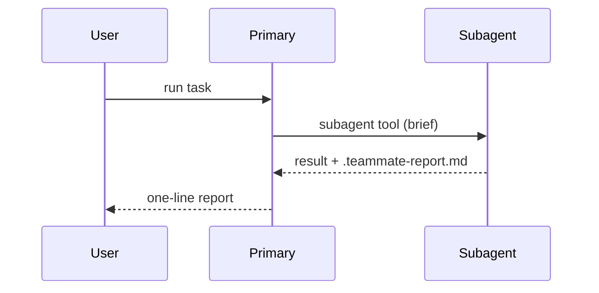

# Showcase work examples

Each example shows one finished change the way a reader can judge it fastest.
Keep only the calls, files, states, and boundaries needed to answer the
reader's next question.

## Show a fix with a behavior diff

The point is what the fix changes, and the surrounding code already exists, so a
`diff` keeps the shape visible.

```diff
 on(save)
-  write content
+  if content is unchanged
+    return cached result
+  write new content
+  invalidate cache
```

Lead with one line: "Saving unchanged content no longer rewrites the file."

## Show a file-layout change

When the shape of the change is the point, diff a shallow file tree.

```diff
 src/skills/
 ├── team-mate/
 ├── delegate-task/
 ├── review-work/
+└── commit-changes/
+    └── SKILL.md         # new common skill
```

## Show a call-flow change

Use a call tree when the change moves or adds a step in a flow. Show only the
calls around the change.

```diff
 submitForm
   createSession
     persistPrompt
+    expandSkillMention
     launchAgent
-  navigateToSession
+  navigateToSession
+    subscribeToEvents
```

## Show a state or logic change as pseudocode

Pseudocode answers "what does it do now" without the reader parsing the real
syntax.

```text
on(request)
  if request is already in flight
    return the existing future
  start the request
  cache the future until it settles
```

## Show an interaction change with Mermaid

Use a sequence or flow diagram when the change crosses a boundary and prose
would be slower.



## Show proof with command output

For "it works", the strongest artifact is the real command and its actual
output. Paste the command and only the lines that show the result.

```text
$ python3 -m pytest src/scripts -q
12 passed in 0.42s
```

## Show a visual result with one HTML file

When the change is visual, spatial, or too dense for Mermaid, write one focused
HTML view — a diagram, an infographic, or a short slide deck, whichever fits.
Use real labels and data, match the product's colors and type, support desktop
and mobile, then open it for the reader:

```text
open showcase-work-login-flow.html
```

Keep the file to the one view that answers the question. Do not rebuild the
whole app to show a corner of it.
